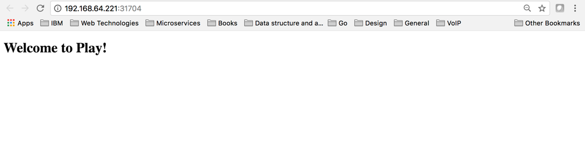

# Play Framework - Get Starter

[Get started](https://playframework.com/documentation/2.6.x/Home)

# Setup

## Install sbt
sbt is a Scala Build Tools, we will use this to work with Play Framework

### on mac
Install sbt on mac using brew
```

```

# Create a new starter Application

```
sbt new playframework/play-java-seed.g8
```

# Run the Application

```
sbt run
```

# Access the application
```
http://localhost:9000
```

# Dockerize the Application

Edit the build.sbt, add the following to it
```
// setting a maintainer which is used for all packaging types
maintainer := "Your Name"

// exposing the play ports
dockerExposedPorts in Docker := Seq(9000, 9443)
```

## Build for production mode
Before you run your application in production mode, you need to generate an application secret. This is to avoid all sorts of attacks on web applications. If Play does not find a secret key during a run operation, it will throw an error.

You can create one by going to the application.conf file located in /conf at the root of your application. Look for the following line: play.crypto.secret = "changeme". If Play finds that the secret key has not been changed from the default changeme, it will throw an error.

For simplicity's sake, we can change it to 0123456789.

### Edit application.conf
in file ./conf/application.conf

add the following
```
play.http.secret.key = "0123456789"

play.filters.hosts {
  # Allow requests to example.com, its subdomains, and localhost:9000.
  allowed = ["192.168.64.221", "localhost:9000"]
}
```

## Create the image
```
sbt docker:publishLocal
```

## List the docker images
```
docker images
```

## Run the image
```
docker run -p 9000:9000 play-javaapp:1.0-SNAPSHOT
```

### test it as documented above
```
curl -I http://localhost:9000
```

### the expected output
```
HTTP/1.1 200 OK
Referrer-Policy: origin-when-cross-origin, strict-origin-when-cross-origin
X-Frame-Options: DENY
X-XSS-Protection: 1; mode=block
X-Content-Type-Options: nosniff
Content-Security-Policy: default-src 'self'
X-Permitted-Cross-Domain-Policies: master-only
Date: Sat, 02 Dec 2017 02:35:33 GMT
Content-Type: text/html; charset=UTF-8
Content-Length: 440
```

# Push the image to ICP image repo
**Notes**
- specify your master IP in your /etc/hosts file

## login to docker
```
docker login mycluster.icp:8500
```

## tag the image
```
docker tag play-javaapp:1.0-SNAPSHOT mycluster.icp:8500/jaricdev/play-javaapp:1.0
```

## push the image
```
docker push mycluster.icp:8500/jaricdev/play-javaapp:1.0
```

# Deploy the image
To deploy the image pushed to private repo of [IBM Cloud private](https://www.ibm.com/cloud-computing/products/ibm-cloud-private/), from the menu Workloads/Deployments enter the following information in the 'Create Deployment' dialog.

General Tab

name | value
-----| -----
Name | js-play-web

Container settings Tab

name | value
-----| -----
Name | js-play-web
Image | mycluster.icp:8500/jaricdev/play-javaapp:1.0
Container port | 9000
https://github.com/ibmcloudprivate2/dotnet/tree/master/images


# Expose the deployment with Service

General Tab

name | value
-----| -----
Name | js-play-web-service
Type | NodePort

Ports Tab

name | value
-----| -----
TCP | http, 9000, 9000

Selectors Tab

name | value
-----| -----
app | js-play-web


# Operation on application deployed
You can deploy new version of image, rollback, scale and remove your deployment from the deployment dashboard. Search for your application and click on the vertical ellipsis "..." as shown below.


# Access the application
You can access your application from Service dashboard, search for your application and from there you can find your application endpoint and remove the service.


## the play framework java application
Below shows the application running in [IBM Cloud private](https://www.ibm.com/cloud-computing/products/ibm-cloud-private/)



# Issues

1. secret key
When we Dockerize a play application, we need to specify a secret key in application.conf.
If Play does not find a secret key during a run operation, it will throw an error.

To resolve this, you will need to add the following into application.conf file.
```
play.http.secret.key = "**<changeme>**"
```

2. Allowed hosts filter
the default application.conf do not have any configuration in it, when image is deployed the application is not accessible.

To resolve this, you will need to configure the allowed hosts filter.

For more information on allowed hosts filter [here](https://www.playframework.com/documentation/2.6.x/AllowedHostsFilter).

```
play.filters.hosts {
  # Allow requests to example.com, its subdomains, and localhost:9000.
  allowed = ["192.168.64.221", "localhost:9000"]
}
```


# References
- [Dockerizing a Java Play Application](https://semaphoreci.com/community/tutorials/dockerizing-a-java-play-application)
- [Dockerize Play Framework Applications](https://github.com/peerdavid/ComeAndGo/wiki/Dockerize-Play-Framework-Application)
